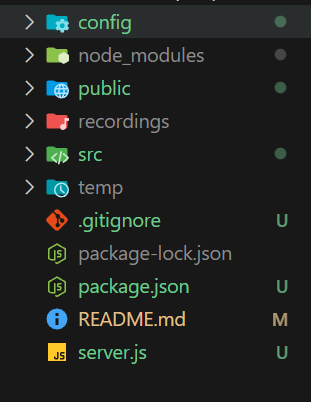

# 시작하기에 앞서 root에 recordings와 temp폴더를 꼭 추가해주세요!

# 사용방법
## 시작하기
     terminal에서
     npm install
     npm start 
이후 localhost:3000으로 접속하면 테스트 프론트엔드 화면이 나옵니다.

탭을 여러 개 띄워서 한명씩 참여하면 recordings에 누적으로 병합되는 파일이 생성되는 것을 볼 수 있습니다. 회의 종료를 하면 지금까지 녹음이 모두 저장됩니다.
새로운 사용자가 들어오면 중간에 1초정도 녹음이 끊기는데 이 부분은 크게 상관없기도 하고 너무 시간이 오래걸릴 것 같아서 일단 배제하였습니다.
